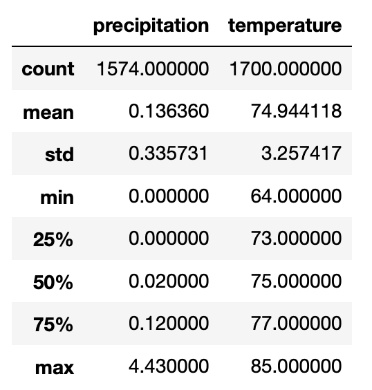
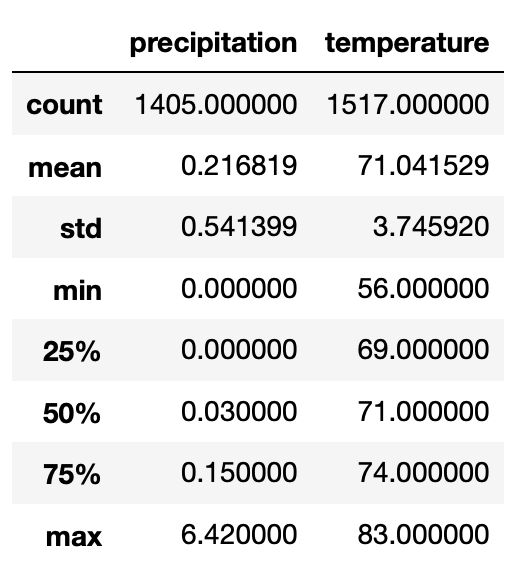

# surfs_up

Challenge #9

In this challenge, we were tasked to figuring out the key aspects of Oahu’s seasonal weather data. The weather can be very variable, and we need to ensure we have looked at the major 2 seasons to see whether this location is viable.

The goals of this challenge are to:

- Determine key statistical data about the month of June.
- Determine key statistical data about the month of December.
- Compare your findings between the month of June and December.
- Make 2 or 3 recommendations for further analysis.
- Share your findings in the Jupyter Notebook.

Oahu looks like it could be an ideal place for a surf/ice cream business.
The below is a recap of the June data

The below is a recap of the December data

I believe that the mean precipitation and temperatures will be the most useful for us. In June the mean temp is 74.9 vs in December of 71 degrees. I also checked to make sure that there was no major outliers that were skewing the data. The median temperatures are almost the exact same. The 4 degree difference in average temperature should alleviate some concerns. For the precipitation, it is 0.14 vs 0.21 in Dec. While this is a jump, I believe that it should be fine as it is not a major difference. I also looked at the max and min temperatures. Oahu's max temp in June is only 2 degrees higher than in December. The low in June is 8 degrees higher than the low in December. The above data shows a very consistent weather pattern that should be ideal for this new business venture. One thing that we should note, is that there is December data that is missing for 2017. I think that the sample size is large enough that this should be ok.

For further research I would look into the following:
- is there a source for wave, tidal, wind, and moon cycle data? These all may have insights as to the quality of the location. Are there consistent waves? are the waves for extremely advanced riders only?
- In a lot of regions Dec is not the coldest month. We should look at every month to see if there are ones that stand out.
- We might want to look at each individual weather station. I don't know the size of Oahu, or wether the weather patterns can be hyper local. Maybe one side of the island can be much cooler than another
- Other weather patterns that we can look at? tropical storms and volcanic activity? Maybe Oahu is ideal for surfing, but prone to earthquakes. 
- we should look for the location taking into account how many other stores are around, the tourism density, and how easy it is to reach the location.

